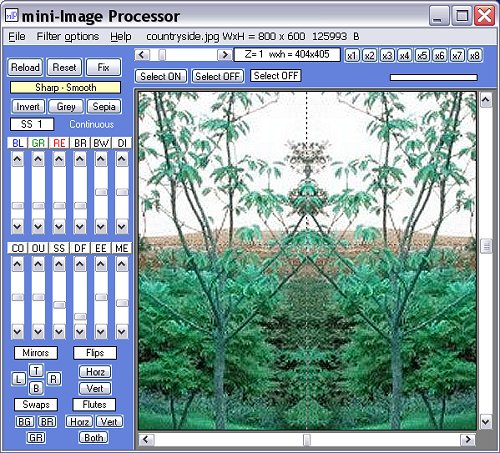



## mini\-Image Processor \(Update 13  Aug\)

### Description

mini-Image Processor by Robert Rayment. Demo of one way to load a standard picture into an array using GetDIBits, where the picture box is just a viewport, with zooming (using StretchDIBits) and scrolling. Pictures can be saved as 24bpp BMP or JPEG, either from the viewport, the whole image from the array or a selection. To make it a bit more interesting I've added a few effects to play with. If the manifest file causes problems then just rename or delete it. Only tested on WinXP. Zip 29 KB.

----

Update 3 Aug: Pictures with width or height &lt; 15 pixels were disallowed, now changed to &lt;= 2 pixels. Consequently a correction to FileOps, the Flute filter and scrZoom.

----

Update 4 Aug: Added saving to JPEG using the Ron van Tilburg (John Korejwa) class at CodeId=50351. Zip 49 KB.

----

Update 5 Aug: Minor correction to vertical scrollbar position when zooming in with the horizontal cross-wire at the bottom of the picture. Also turn Select OFF when a scrollbar switches off.

----

Update 10 Aug: LoadPicture Function simplified a bit.

----

Update 11 Aug: Moved vertical scroll bar to normal position on the right of the viewport. Also New pictures now open at top-left instead of at bottom-left. Correction to edging for SmoothSharp effect. Option to change filter effects to continuous or stepped. Plus some minor tidying up. Zip 51 KB.

----

Update 12 Aug: Buttons above the filter scrollbars will now act on the scrollbar value without having to press the scrollbars, in continuous or stepped mode.

----

Update 13 Aug: Added routine to cJpeg.cls to save jpeg from data array, with Ron van Tilburg's help. Plus a few minor adjustments.

Forgot to put manifest file in.
 
### More Info
 
Pictures

Just run

             |
---                |---
**Submitted On**   |2006-08-13 14:31:50
**By**             |[Robert Rayment](https://github.com/Planet-Source-Code/PSCIndex/blob/master/ByAuthor/robert-rayment.md)
**Level**          |Intermediate
**User Rating**    |5.0 (120 globes from 24 users)
**Compatibility**  |VB 6\.0
**Category**       |[Graphics](https://github.com/Planet-Source-Code/PSCIndex/blob/master/ByCategory/graphics__1-46.md)
**World**          |[Visual Basic](https://github.com/Planet-Source-Code/PSCIndex/blob/master/ByWorld/visual-basic.md)
**Archive File**   |[mini\-Image2013788162006\.zip](https://github.com/Planet-Source-Code/robert-rayment-mini-image-processor-update-13-aug__1-66162/archive/master.zip)

### API Declarations

GetDIBits, StretchDIBits plus a few

